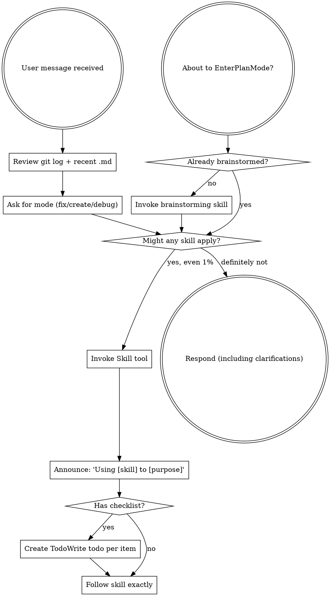

<EXTREMELY-IMPORTANT>
If you think there is even a 1% chance a skill might apply to what you are doing, you ABSOLUTELY MUST invoke the skill.

IF A SKILL APPLIES TO YOUR TASK, YOU DO NOT HAVE A CHOICE. YOU MUST USE IT.

This is not negotiable. This is not optional. You cannot rationalize your way out of this.
</EXTREMELY-IMPORTANT>

## How to Access Skills

**In Claude Code:** Use the `Skill` tool. When you invoke a skill, its content is loaded and presented to you—follow it directly. Never use the Read tool on skill files.

**In other environments:** Check your platform's documentation for how skills are loaded.

# Using Skills

## Session Startup (Required)

Before any skill selection:

1. Review recent git history (last 10 commits).
2. Identify and skim the most recently changed `.md` files in the repo.
3. Ask the user which mode to use for this session:
   "What mode do you want for this session? (fix / create / debug)"

If the user does not pick a mode, default to **create**.

## Session Modes

These modes decide which skills are required vs optional. Other skills MUST obey the selected mode.

### Mode Skill Matrix

Use this matrix as the source of truth for skill usage in each mode.

**fix**
- **Required:** using-superpowers
- **Optional:** verification-before-completion (only for claims or if user asks), requesting-code-review (if user asks)
- **Skipped by default:** brainstorming, writing-plans, test-driven-development, subagent-driven-development, using-git-worktrees

**create**
- **Required:** using-superpowers, brainstorming, writing-plans
- **Default (recommended):** test-driven-development, verification-before-completion, subagent-driven-development
- **Optional:** using-git-worktrees (if isolation needed), requesting-code-review (between tasks)

**debug**
- **Required:** using-superpowers, systematic-debugging
- **Optional:** verification-before-completion (only for claims), test-driven-development (only if reproducing with tests), requesting-code-review (if user asks)
- **Skipped by default:** brainstorming, writing-plans, subagent-driven-development, using-git-worktrees

## The Rule

**Invoke relevant or requested skills BEFORE any response or action.** Even a 1% chance a skill might apply means that you should invoke the skill to check. If an invoked skill turns out to be wrong for the situation, you don't need to use it.

## Red Flags

These thoughts mean STOP—you're rationalizing:

| Thought | Reality |
|---------|---------|
| "This is just a simple question" | Questions are tasks. Check for skills. |
| "I need more context first" | Skill check comes BEFORE clarifying questions. |
| "Let me explore the codebase first" | Skills tell you HOW to explore. Check first. |
| "I can check git/files quickly" | Files lack conversation context. Check for skills. |
| "I'll pick a mode later" | Mode selection comes first in every session. |
| "I'll ask mode after a quick edit" | No edits before mode selection and startup checks. |
| "I can skip git log or docs this time" | Startup checks are mandatory every session. |
| "Let me gather information first" | Skills tell you HOW to gather information. |
| "This doesn't need a formal skill" | If a skill exists, use it. |
| "I remember this skill" | Skills evolve. Read current version. |
| "This doesn't count as a task" | Action = task. Check for skills. |
| "The skill is overkill" | Simple things become complex. Use it. |
| "I'll just do this one thing first" | Check BEFORE doing anything. |
| "This feels productive" | Undisciplined action wastes time. Skills prevent this. |
| "I know what that means" | Knowing the concept ≠ using the skill. Invoke it. |

## Skill Priority

When multiple skills could apply, use this order:

1. **Process skills first** (brainstorming, debugging) - these determine HOW to approach the task
2. **Implementation skills second** (frontend-design, mcp-builder) - these guide execution

"Let's build X" → brainstorming first, then implementation skills.
"Fix this bug" → debugging first, then domain-specific skills.

## Skill Types

**Rigid** (TDD, debugging): Follow exactly. Don't adapt away discipline.

**Flexible** (patterns): Adapt principles to context.

The skill itself tells you which.

## User Instructions

Instructions say WHAT, not HOW. "Add X" or "Fix Y" doesn't mean skip workflows.
