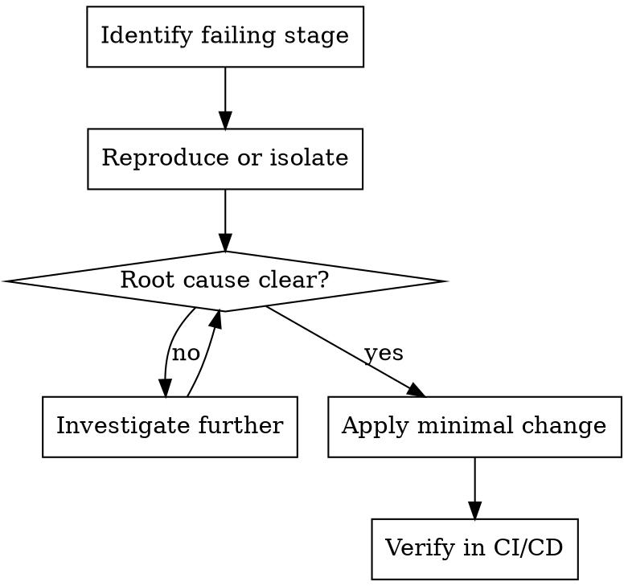

# CI/CD Mode

## Goal

Pipelines, automation, and safe deployments with verified evidence.

## Base Flow

1. Identify which pipeline stage fails.
2. Reproduce or isolate the issue.
3. Apply minimal changes.
4. Verify in CI/CD with evidence.

## Execution Diagram

## Skills

### Recommended

- `../../systematic-debugging/SKILL.md` — Diagnose pipeline failures.
- `../../verification-before-completion/SKILL.md` — Verify build/tests before claiming success.

### Optional

- `../../dispatching-parallel-agents/SKILL.md` — Independent failures in different stages.
- `../../requesting-code-review/SKILL.md` — Sensitive deploy changes.
- `../../test-driven-development/SKILL.md` — Logic changes with tests.
- `../../writing-plans/SKILL.md` — Larger or multi-step changes.
- `../../using-git-worktrees/SKILL.md` — Isolate infra changes.
