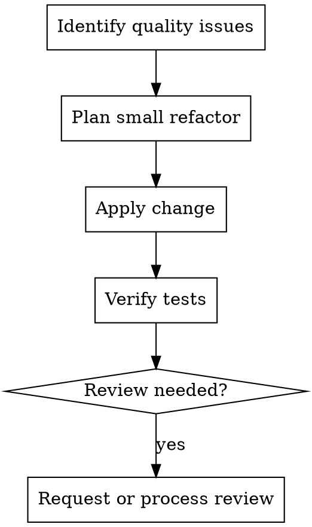

# Code Quality Mode

## Goal

Improve code quality: refactor, standards, and technical reviews.

## Base Flow

1. Identify tech debt or quality issues.
2. Apply refactor or adjustments with small changes.
3. Verify tests stay green.
4. Request or process reviews when needed.

## Execution Diagram

## Skills

### Recommended

- `../../requesting-code-review/SKILL.md` — Review quality changes before merge.
- `../../receiving-code-review/SKILL.md` — Process feedback with technical rigor.
- `../../verification-before-completion/SKILL.md` — Verify before claiming done.

### Optional

- `../../test-driven-development/SKILL.md` — Refactor guided by tests.
- `../../systematic-debugging/SKILL.md` — If refactor introduces failures.
- `../../writing-plans/SKILL.md` — Large or multi-step refactors.
