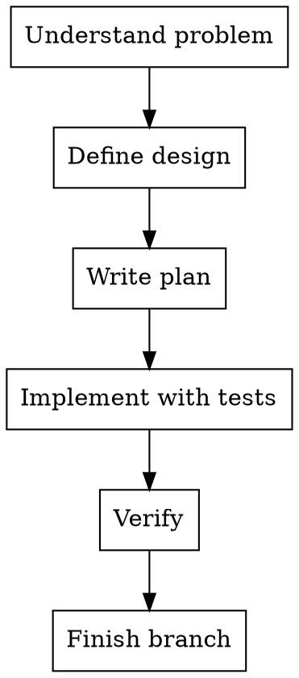

# Create Mode

## Goal

Define, document, and build a complete solution end-to-end.

## Base Flow

1. Understand the problem and propose approaches.
2. Define design and documentation.
3. Write a detailed implementation plan.
4. Implement with tests.
5. Verify and close the work.

## Execution Diagram

## Skills

### Recommended

- `../../brainstorming/SKILL.md` — Define design before implementation.
- `../../writing-plans/SKILL.md` — Create a detailed plan by tasks.
- `../../test-driven-development/SKILL.md` — Test-first implementation.
- `../../verification-before-completion/SKILL.md` — Verify before claiming done.

### Optional

- `../../using-git-worktrees/SKILL.md` — Isolate work in a new branch.
- `../../subagent-driven-development/SKILL.md` — Execute plan per task with reviews.
- `../../executing-plans/SKILL.md` — Execute plan in a parallel session.
- `../../requesting-code-review/SKILL.md` — Review before merge.
- `../../finishing-a-development-branch/SKILL.md` — Close branch with clear options.
