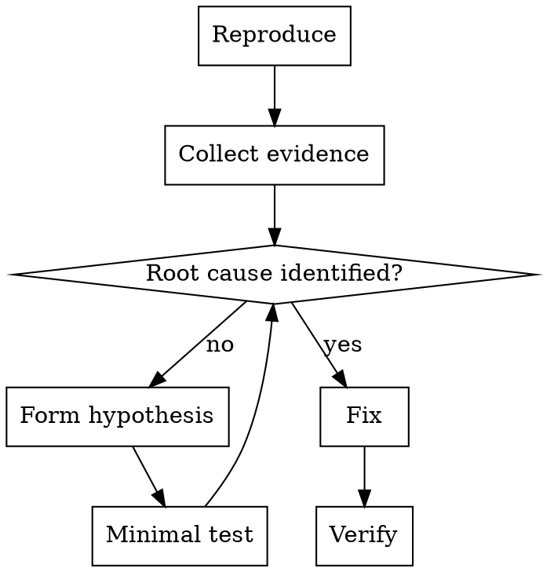

# Debug Mode

## Goal

Diagnose and find root cause before proposing or applying changes.

## Base Flow

1. Reproduce the failure with clear steps.
2. Investigate root cause with evidence.
3. Test a minimal hypothesis.
4. Fix only once the cause is clear.

## Execution Diagram

## Skills

### Recommended

- `../../systematic-debugging/SKILL.md` — Phase-based debugging.
- `../../verification-before-completion/SKILL.md` — Evidence before claiming fixed.

### Optional

- `../../dispatching-parallel-agents/SKILL.md` — Multiple independent failures.
- `../../test-driven-development/SKILL.md` — If a test can reproduce the issue.
- `../../requesting-code-review/SKILL.md` — Validate complex fixes.
- `../../using-git-worktrees/SKILL.md` — Isolate investigation.

### Avoid by Default

- `../../brainstorming/SKILL.md` — Design-first is not the priority in debug.
- `../../writing-plans/SKILL.md` — Formal plans are unnecessary.
- `../../subagent-driven-development/SKILL.md` — Heavy workflow for debug.
- `../../executing-plans/SKILL.md` — Not applicable without a plan.
