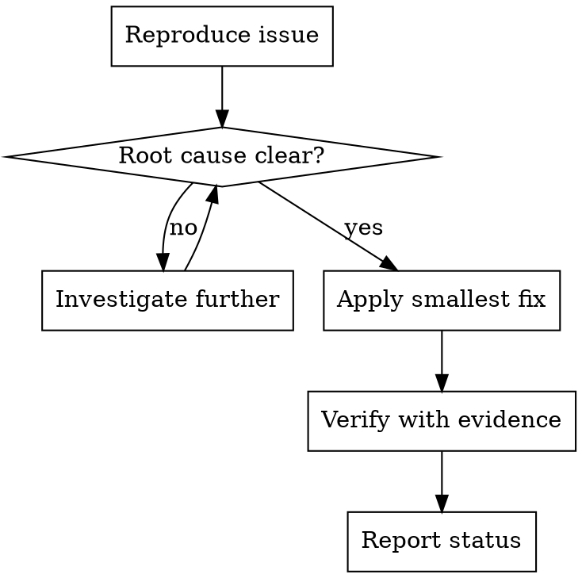

# Fix Mode

## Goal

Resolve code problems quickly. Documentation is not required unless explicitly requested.

## Base Flow

1. Reproduce and understand the issue.
2. Apply the smallest possible fix.
3. Verify with evidence before declaring it resolved.

## Execution Diagram

## Skills

### Recommended

- `../../systematic-debugging/SKILL.md` — Root-cause diagnosis before fixing.
- `../../verification-before-completion/SKILL.md` — Evidence before claiming done.

### Optional

- `../../test-driven-development/SKILL.md` — Use when you can reproduce with tests.
- `../../requesting-code-review/SKILL.md` — For sensitive or complex changes.
- `../../dispatching-parallel-agents/SKILL.md` — Multiple independent failures.
- `../../using-git-worktrees/SKILL.md` — Isolate work if needed.
- `../../finishing-a-development-branch/SKILL.md` — Close a branch once fixed.

### Avoid by Default

- `../../brainstorming/SKILL.md` — Design-first is not the priority here.
- `../../writing-plans/SKILL.md` — Formal plans are unnecessary.
- `../../subagent-driven-development/SKILL.md` — Heavy workflow for quick fixes.
- `../../executing-plans/SKILL.md` — Not applicable without a plan.
