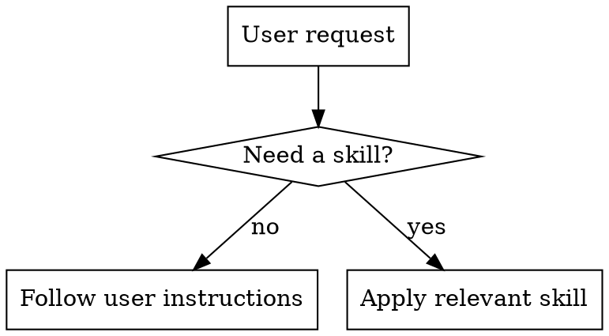

# Free Mode

## Goal

No mode. Follow the user's instructions without imposing extra process.

## Base Flow

1. Follow user instructions as given.
2. Use skills only when they clearly add value.
3. Avoid forcing workflows.

## Execution Diagram

## Skills Catalog (all optional)

- `../../brainstorming/SKILL.md` — Define a design before implementation.
- `../../dispatching-parallel-agents/SKILL.md` — Parallelize independent tasks.
- `../../executing-plans/SKILL.md` — Execute a written plan in another session.
- `../../finishing-a-development-branch/SKILL.md` — Close a branch with merge/PR/cleanup options.
- `../../receiving-code-review/SKILL.md` — Process review feedback with technical rigor.
- `../../requesting-code-review/SKILL.md` — Request code review at key points.
- `../../subagent-driven-development/SKILL.md` — Execute plans task-by-task with subagents and reviews.
- `../../systematic-debugging/SKILL.md` — Debug systematically before fixing.
- `../../test-driven-development/SKILL.md` — TDD for features and fixes.
- `../../using-git-worktrees/SKILL.md` — Isolate work with worktrees.
- `../SKILL.md` — Select mode and decide applicable skills.
- `../../verification-before-completion/SKILL.md` — Verify before claiming completion.
- `../../writing-plans/SKILL.md` — Write a detailed implementation plan.
- `../../writing-skills/SKILL.md` — Create or edit skills with TDD.
