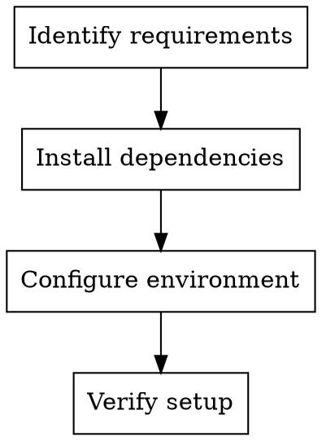

# Setup Mode

## Goal

Install, configure, and bring up the environment with clear steps.

## Base Flow

1. Detect environment requirements and dependencies.
2. Apply minimal configuration to get it running.
3. Verify the environment is operational.

## Execution Diagram

## Skills

### Recommended

- `../../verification-before-completion/SKILL.md` — Verify the environment works.
- `../../systematic-debugging/SKILL.md` — Diagnose setup failures.

### Optional

- `../../writing-plans/SKILL.md` — Long or multi-step setup.
- `../../requesting-code-review/SKILL.md` — Validate script changes.
- `../../using-git-worktrees/SKILL.md` — Isolate large setup changes.
