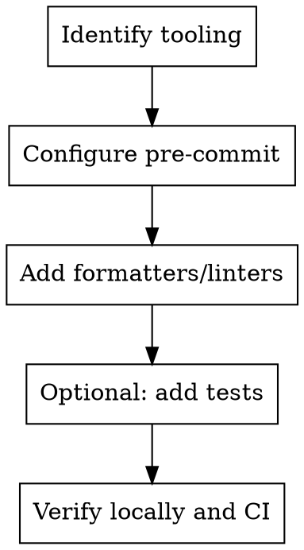

# Setup Mode

## Goal

Set up developer tooling with a strong pre-commit workflow (formatters, linters, and optional tests).

## Base Flow

1. Identify required formatters, linters, and test tooling.
2. Configure a pre-commit pipeline to run them consistently.
3. Make tests optional in pre-commit (fast vs full checks).
4. Verify tooling runs locally and in CI.

## Execution Diagram

## Skills

### Recommended

- `../../verification-before-completion/SKILL.md` — Verify the environment works.
- `../../systematic-debugging/SKILL.md` — Diagnose setup failures.

### Optional

- `../../writing-plans/SKILL.md` — Long or multi-step setup.
- `../../requesting-code-review/SKILL.md` — Validate script changes.
- `../../using-git-worktrees/SKILL.md` — Isolate large setup changes.
